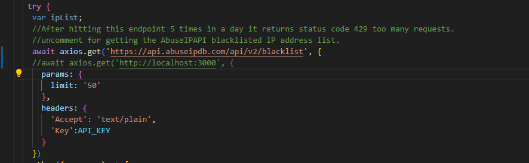
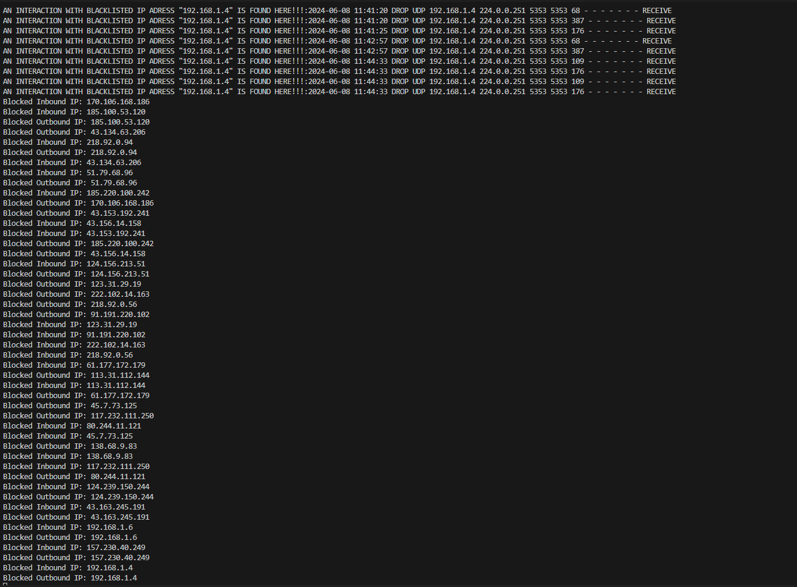
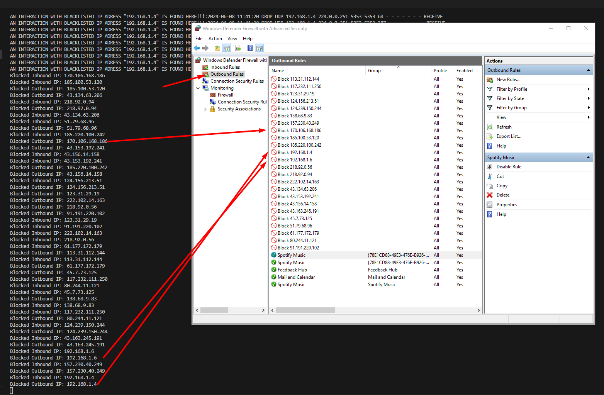
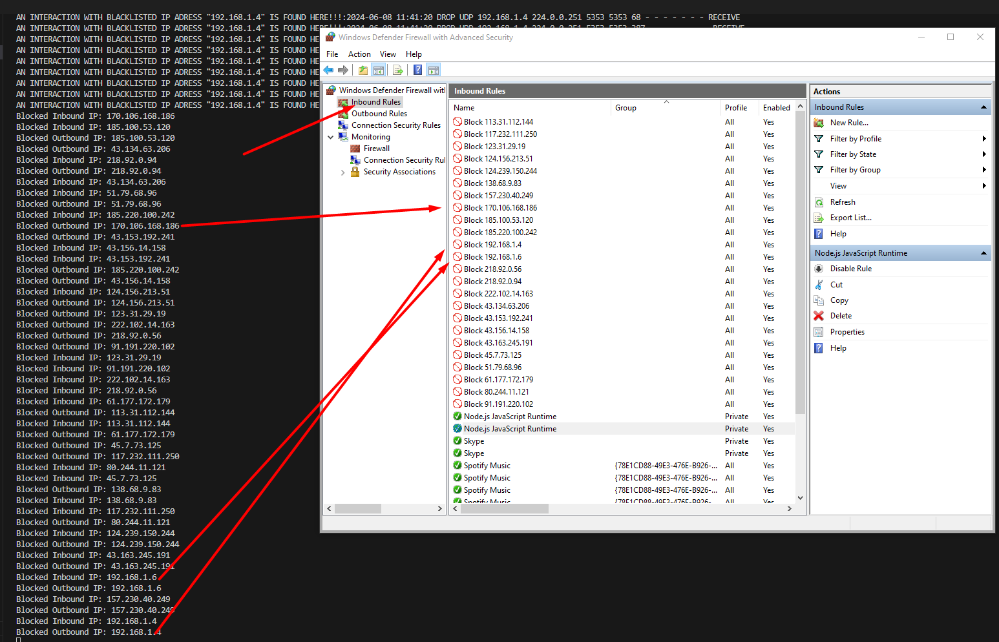
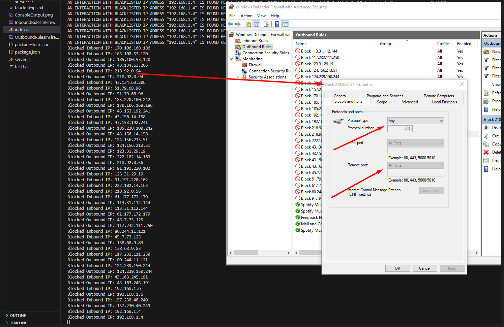
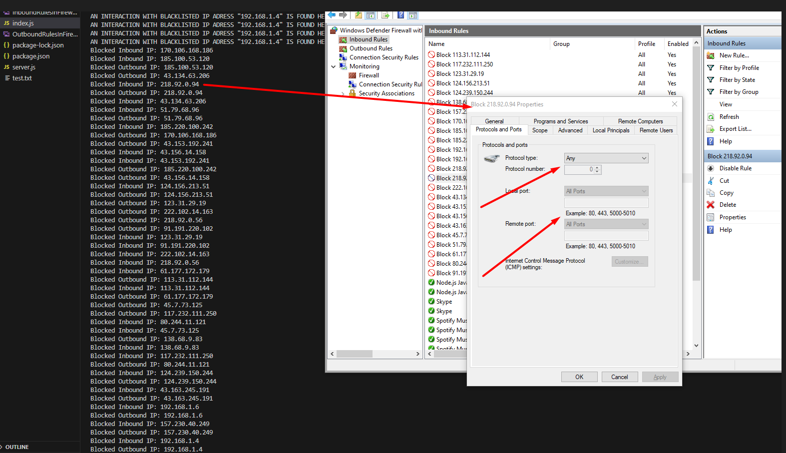
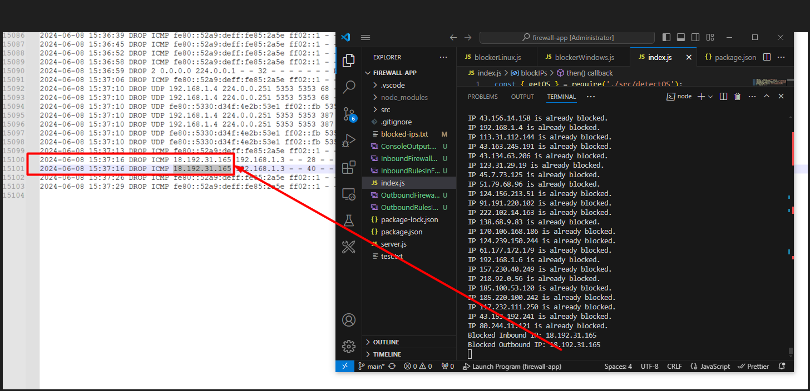

Installation:
git clone https://github.com/yockoman/firewall-app.git
cd firewall-app
npm install

Usage:
if you want to use the local endpoint that returns some IP addresses imitating the API Call to the ABUSE IP first you need to run "node .\server.js" and change the code to run on localhost:3000 in the fetchBlacklistedIPs.js file

node index.js

// optional
node index.js "directory to communication history file" -- for example node index.js test.txt
node index.js "directory to communication history file" "number of days in the past to search for in the history file" -- for example node index.js test.txt 6

WINDOWS:
Firstly when running the application with both the optional input arguments the application gets a list of blacklisted IP addresses, 
creates firewall Inbound and Outbound firewall rules, then runs through all these IP addresses and searches for interactions from these IPs 
in the inputted log file, in my case the firwall log file (In order to work the firewall logging must be enabled - https://help.pdq.com/hc/en-us/articles/360053040851-See-Firewall-Activity-in-Windows-Defender-Firewall-Logs). The output of the console can be seen here:

The next thing to observe is that the firewall rules are indeed added to the firewall:
Outbound Rules:

Inbound Rules:

The properties of the firewall rules can be seen here:
Outbound rule:

Inbound rule:

When trying to interact with application from a blacklisted IP we can observe that the packets are dropped from the firewall logs:

